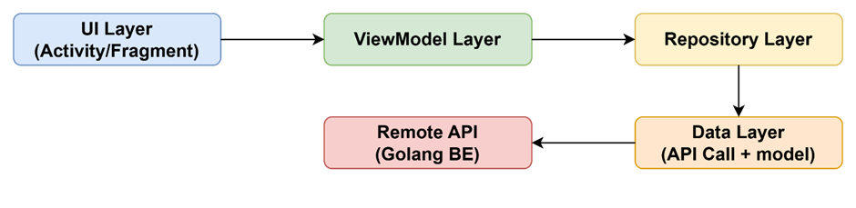
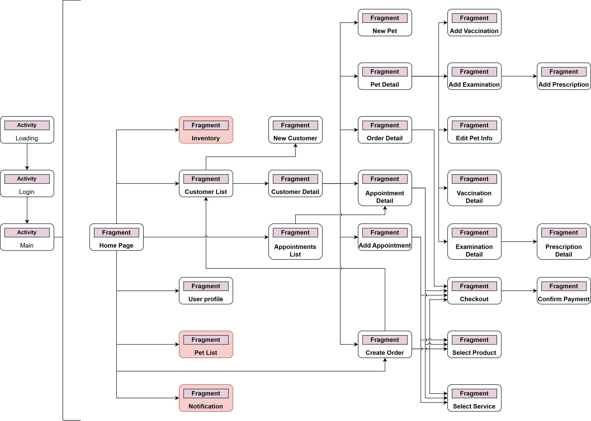
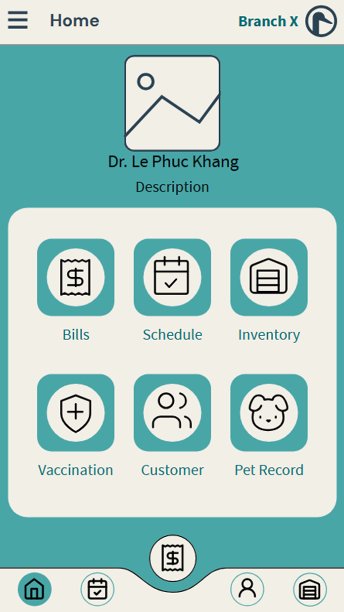

# 🐾 PetCareShop for Staff

**PetCareShop for Staff** is an Android mobile application that helps pet shop staff manage appointments, invoices, products, pets, customers, and medical records.

## 📱 Features

- Staff login with secure credentials
- View and create pet care appointments
- Create invoices from selected services/products
- Manage customer and pet information
- Record pet medical history and prescriptions

## 🏗️ System Architecture

This app follows the **MVVM (Model - View - ViewModel)** pattern with clear separation of concerns and layered architecture:
```
Fragment (UI) → ViewModel → Repository → Retrofit API → Backend (Golang Microservices)
```



- **Language:** Java
- **Architecture:** MVVM + Navigation Component (no DataBinding)
- **API:** Retrofit2 with JWT Token and OkHttp Interceptor
- **Backend:** Golang Microservices (7 services: product, appointment, order, payment, user, record, notification)

🔗 **Backend repository:** [PetCareShop Backend (Golang)](https://github.com/quanbin27/BEPetCare)

## 🗂️ Project Structure

```
com.petcare.staff
├── data
│   ├── local
│   ├── model (api/ui/mapper)
│   ├── remote
│   └── repository
├── ui (appointment, billing, customer, pet, ...)
├── utils
└── MainActivity
```

## 🧭 Layout Graph



## 💻 Requirements

- Android Studio Hedgehog or later
- Android SDK version 24 or higher
- Active internet connection to access backend

## 🧪 Demo



> ⚠️ UI and features may vary depending on user role and backend data


## 📃 License

This project is for internal use and educational purposes only. Do not use for commercial purposes without permission.

---
